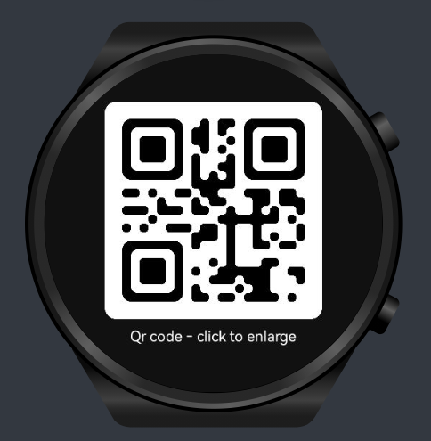

## QR code ability

this is a demo project showing you how to generate and display QR code in HarmonyOS wearable (watch) app using Zxing
library

 

## tutorial
#### 1. Add Zxing library to your project

in `build.gradle` add the Zxing dependency:

```groovy
dependencies {
    //... your existing dependecies

    implementation 'io.openharmony.tpc.thirdlib:BGAQRCode-core:1.0.3'
    implementation 'io.openharmony.tpc.thirdlib:BGAQRCode-zxing:1.0.3'

}
```

#### 2. Generate Qr code

generate QR code by calling method `syncEncodeQrCode` of class `QRCodeEncoder` that part of Zxing library, the method is synchronous and will freeze the UI, you have to call it in a separate thread as follows

```java
new Thread(()->{
        PixelMap qrCodePixelMap = QRCodeEncoder.syncEncodeQRCode(qrCodeString,size.get());
}).start();
```
***as we run the encoding function in a thread, make sure to call the UI related methods in the UI thread***

#### 3. display QR code

the result of encoding the QR code is a pixelMap (bitmap), and can display using Image component.
1. add Image to your layout

```xml
 <Image
    ohos:id="$+id:qr_code"
    ohos:height="150vp"
    ohos:width="150vp"
    ohos:background_element="#323232"
    ohos:scale_mode="clip_center"
    ohos:visibility="visible"
 />
```

2. show the QR code by settings QR code as image src, this must be done in the UI thread
```java
getUITaskDispatcher().syncDispatch(() -> {
        Image qrCodeImage = (Image) findComponentById(ResourceTable.Id_qr_code_image)
        qrCodeImage.setPixelMap(qrCodePixelMap);
});
```

*`getUITaskDispatcher()` is provided by Ability class*

## use this demo in your project
1. add the library to your project (step 1)
2. copy the class `QrCodeAbility` and layout `ability_qr_code.xml` to your project
3. declare the `QrCodeAbility` in `config.json`
4. call static method `QrCodeAbility.startAbility` passing the QrCode content as a string
```java
    QrCodeAbility.startAbility(this, "qr code content");
``` 

## for other devices
the code should work for all harmonyOS devices, this demo is designed for wearables, to use in your project you must update QR code size in `ability_main.xml` and `QrCodeAbility.java`

## references
1. zxing: https://gitee.com/openharmony-tpc/zxing
2. Image component: https://developer.harmonyos.com/en/docs/documentation/doc-guides/ui-java-component-image-0000001058976860

## license
```text
 No Copyright !© 2023 Younes Megaache
```
